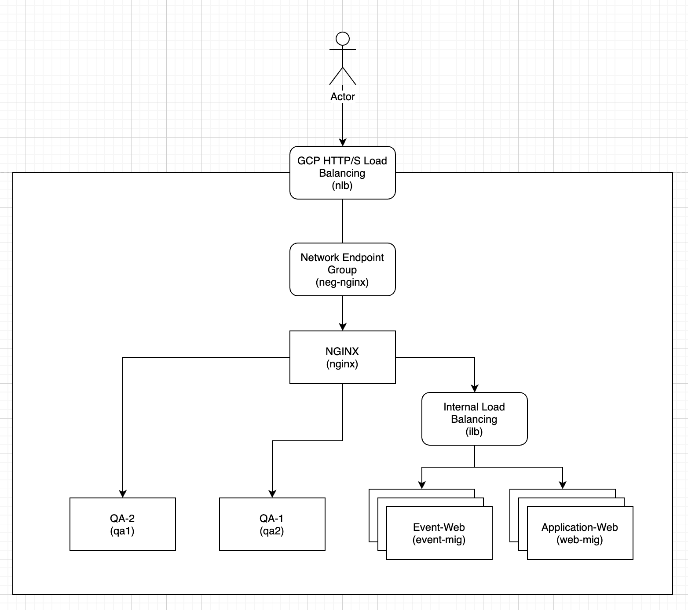

Overview
========

In this lab I will be setting up a Nginx machine that forward traffic to corresponding backend services based on request DNS and source IP address

Prerequisites
====================

-   You should be familiar with GCP's services and know how to configure `Load Balancing` and `Network Endpoint Group`

-   Assuming we have below services ready

|Component              |Value              |Comment| IP address|
|:--:|:--:|:--:|:--:|
|External Load Balancer |nlb                |External load balancer which  accepts incoming traffic from the internet<br/>Route traffic to Nginx backend| |
|Internal Load Balancer |ilb                |Internal load balancer which route traffic to `application-web` |10.100.1.4|
|Internal Load Balancer |ilb                |Internal load balancer which route traffic to `event-web`|10.100.1.5|
|Managed Instance Group |web-mig            |Managed Instance Group of `Application Web`||
|Managed Instance Group |event-mig          |Managed Instance Group of `Event Web`||
|Network Endpoint Group |neg-nginx          |NEG for Nginx instance attached to Internal Load Balancing `ilb`|
|GCE Instance|nginx|Ubuntu 18.04 with Nginx installed|10.100.1.3|
|GCE Instance|qa1|QA environemnt 1|10.100.2.3|
|GCE Instance|qa2|QA environment 2|10.100.2.4|
They should be configured as below



What are we building
====================

We will then  setup Nginx to route traffic on below table

|Request FQDN|Source IP|Target|
|:--:|:--:|:--:|
|game1.michaelchi.net|1.2.3.4|Internal Load Balancing `ilb`|
|game2.michaelchi.net|1.2.3.4|Internal Load Balancing `ilb`|
|game1.michaelchi.net|everything other than 1.2.3.4|`qa1`|
|game2.michaelchi.net|everything other than 1.2.3.4|`qa2`|

Steps
=====

First create a custom site configuration file called `custom_server.conf`

```shell
sudo unlink /etc/nginx/sites-enabled/default
cd /etc/nginx/sites-available/
sudo nano custom_server.conf
```

Update `custom_server.conf` with below content

```yaml
upstream qa_app {
     server 10.100.2.3:80;
}
upstream qa_event {
     server 10.100.2.4:80;
}
upstream prod_event {
     server 10.100.1.5:80;
}
upstream prod_app {
     server 10.100.1.4:80;
}
map $proxy_add_x_forwarded_for $environment{
     default "prod";
     ~1.2.3.4 "qa"; # Change 1.2.3.4 to your office's IP address
}
map $http_host $name_of_web {
    #hostnames;
    app.michaelchi.net app;
    event.michaelchi.net event;
}
server {
    listen 80;
    location / {
        #standard proxy settings
        proxy_http_version 1.1;
        proxy_set_header X-Real-IP $remote_addr;
        proxy_redirect off;
        proxy_set_header X-Forwarded-For $proxy_add_x_forwarded_for;    # this will add source IP and XFF headers added by Nginx to HTTP  headers
        proxy_set_header Host $http_host;
        proxy_redirect off;
        proxy_set_header X-Forwarded-Proto $scheme;
        proxy_set_header X-NginX-Proxy true;
        proxy_connect_timeout 600;
        proxy_send_timeout 600;
        proxy_read_timeout 600;
        send_timeout 600;
        set $pool "${environment}_${name_of_web}";      #   Decide environment name
        proxy_pass http://$pool;    # Forward traffic to corresponding `Pool`
    }
}
```

Save and exit nano, restart Nginx service

```shell
sudo ln -s /etc/nginx/sites-available/custom_server.conf /etc/nginx/sites-enabled/custom_server.conf
sudo service nginx configtest
sudo service nginx restart
```

You can also verify Nginx status by running below command
```shell
sudo systemctl status nginx
```

You  should see outpus similar to below

```shell
● nginx.service - A high performance web server and a reverse proxy server
   Loaded: loaded (/lib/systemd/system/nginx.service; enabled; vendor preset: enabled)
   Active: active (running) since Wed 2020-06-17 08:40:49 UTC; 5 days ago
     Docs: man:nginx(8)
 Main PID: 18629 (nginx)
    Tasks: 2 (limit: 4369)
   CGroup: /system.slice/nginx.service
           ├─18629 nginx: master process /usr/sbin/nginx -g daemon on; master_process on;
           └─18634 nginx: worker process
Jun 17 08:40:49 gtw-nginx-proxy systemd[1]: Starting A high performance web server and a reverse proxy server...
Jun 17 08:40:49 gtw-nginx-proxy systemd[1]: nginx.service: Failed to parse PID from file /run/nginx.pid: Invalid argument
Jun 17 08:40:49 gtw-nginx-proxy systemd[1]: Started A high performance web server and a reverse proxy server.
```
