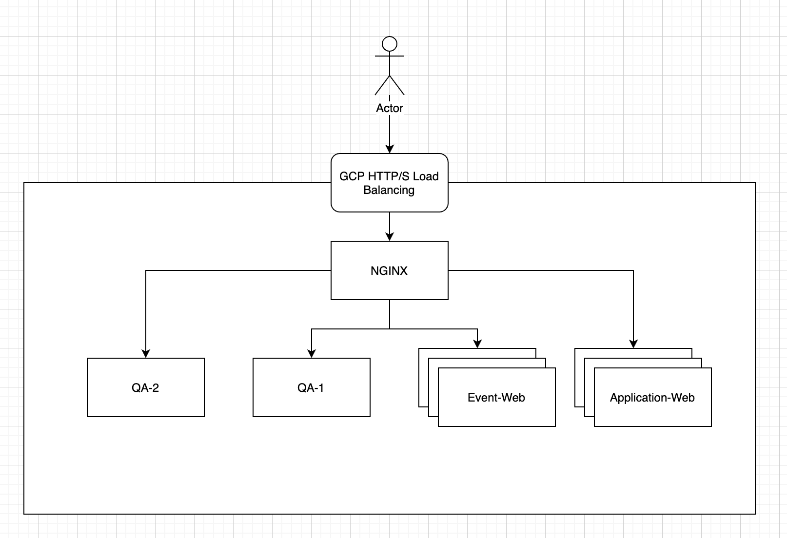

Overview
========

Cloud is a continously envoluting platform. Services provided by Cloud platform  are enriched and enhanced over time. It is also an open environment that gives you flexibility of choosing what is right for you.

Here I am setting up a Nginx machine to work with  Google Platform Cloud Load Balancing to archive traffic routing by source IP address.

The Problem
===========

Some applications requires canary deployment for their QA or Testers to verify applications on production environment. Which in some cases the front-end Load Balancer checks client IP address and foreards these traffic to corresponding backend services.

On GCP, Global HTTP Load Balancing records client IP addresses in `X-Forwarded-For` HTTP header. According to GCP's document, the header is added by Target Proxy. However, at this moment, this header is not accessible to other Load Balancing components such as UrlMaps, hence we are unable to forward traffic on  this header.

What are we solving
===================

We are to simulate an environment, where it has two production websites: `Event Web` and `Application Web`, each represents different web applications.

We have two QA environemnt, `QA-Web` and `QA-Event`, each represents QA environment for different applications.

We  want  to archive below functions:

-   Requests are routed to corresponding production environments based on request DNS names.

-   Requests are routed to QA environments based on source IP addresses, meaning if the traffic came from particular IP, then it is routed to QA environments.

How are we solving
==================

In  order to archive this, we will be creating a Nginx reverse proxy sitting between Google Cloud Load Balancing and Backend services, and configure the Nginx to check request DNS name and source IP addresses to forward traffic to expected backends.

A high-level architecture design are shown below.

What and Why are we choosing these services
===========================================

|Component|Feature|
|:--:|:--:|
|GCP HTTP/S Load Balancing|GCP's native service Mitigate many internet attacks such as DDoS |
|Nginx|Open source Enterprise option Powerful Load balancing and proxy services Rich learning materials available|

* Nginx is an open source solution which are very popular and yet powerful load balancer, proxy and web server. It also come with F5 enterprise level support via Google Cloud platform marketplace.

Next Step
=========

[Setup Nginx](./nginx-setup-nginx.md)

Considerations
==============

-   In this lab I am setting up Nginx as a single machine,  on production environment it should be configured as high-availability mode. Nginx has an official document on how to setup  active-active HA Nginx on GCP[\[1\]](https://docs.nginx.com/nginx/deployment-guides/google-cloud-platform/high-availability-all-active/)

-   When setting up all-active high-available Nginx, you have multiple Nginx instance running to serve your traffic, configuration must be sync'd between instances. This can be done by Nginx-sync[\[2\](https://docs.nginx.com/nginx/admin-guide/high-availability/configuration-sharing/)

- If you  want to setup dynamic IP blocking, Fail2Ban is another popular solution  which works well with Nginx[3]

[1] https://docs.nginx.com/nginx/deployment-guides/google-cloud-platform/high-availability-all-active/

[2] https://docs.nginx.com/nginx/admin-guide/high-availability/configuration-sharing/

[3] https://www.nginx.com/blog/dynamic-ip-blacklisting-with-nginx-plus-and-fail2ban/