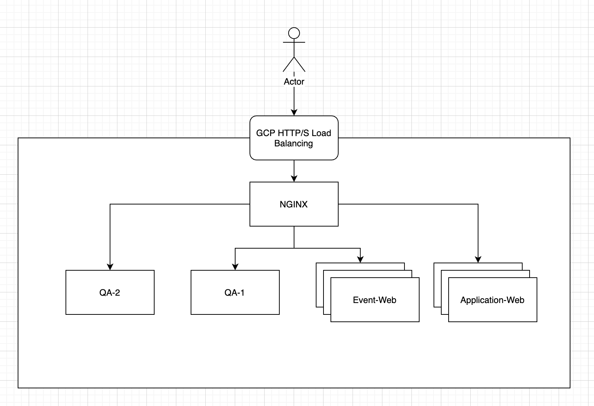

Overview
========

雲平台是一個不斷進化的平台,  會隨著時間不斷的演化, 推出更多更符合使用者需求的服務. 它提供了使用者在選擇解決方案上很大的彈性, 使用者可以根據實際情況選擇適合的第三方服務來使用.

在這個Lab中, 我會透過Nginx與GCP Load Balancing搭配, 來達到`根據來源IP將流量導向不同後端`的需求.

The Problem
===========

某些應用程式需要Canary環境, 讓測試人員可以在正式環境上測試; 此時前端Load Balancing根據來源IP決定應該把流量導向正式環境或是測試環境.

在GCP上, Global HTTP/S Load Balancing會將來源IP放在`X-Forwarded-For`這個Header中, 後續應用可以判斷這個Header決定處理動作. 根據GCP文件上的說明, 這個Header是由Target Proxy所新增, 然而, Load Balancing中的其他元件, 例如`UrlMaps`無法存取這些Header, 也就無法據此作分流.s

What are we solving
===================

在這裡我要模擬一個環境, 在這環境中有兩個正式環境的網站`Event Web`和`Application Web`. 同時, 有兩個QA環境`QA-Web`與`QA-Event`, 各自代表不同網站的測試環境

我想要達到以下目標

-   使用者會因為要求不同的DNS Name被導向不同的應用程式`Event Web`和`Application Web`

-   當使用者從特定IP位址發出請求時(在這裡是1.2.3.4), 會被導向QA環境

How are we solving
==================

為了達成此需求, 我會建立一個位於GCP External HTTP/S Load Balancing與網頁應用中間的Nginx reverse proxy.  並且設定Nginx根據以上情境作分流

架構大致上會像下面這樣

What and Why are we choosing these services
===========================================

|元件|功能|
|:--:|:--:|
|GCP HTTP/S Load Balancing|GCP內建功能 提供各種內建安全機制 |
|Nginx|Open source 提供企業等級支援選項 強大的LB/Proxy機制 豐富的線上資源|

Next Step
=========

[設定Nginx](./nginx-setup-nginx.md)

Considerations
==============

-   在這裡我會建立單一機器節點的Nginx, 但在正式環境中, 你應該建立High-Available的Nginx cluster, 官方文件有非常詳細的說明[\[1\]](https://docs.nginx.com/nginx/deployment-guides/google-cloud-platform/high-availability-all-active/)

-   再建立All-Active HA Nginx時, 你會有多台Nginx機器, 此時在各機器之間同步configuration就變得非常重要, 這裡可以透過`nginx-sync`達成[\[2\](https://docs.nginx.com/nginx/admin-guide/high-availability/configuration-sharing/)

-   如果需要dynamic IP blocking以便更近一步保護應用程式, 可以透過Fail2Ban搭配Nginx[3]

[1] https://docs.nginx.com/nginx/deployment-guides/google-cloud-platform/high-availability-all-active/

[2] https://docs.nginx.com/nginx/admin-guide/high-availability/configuration-sharing/

[3] https://www.nginx.com/blog/dynamic-ip-blacklisting-with-nginx-plus-and-fail2ban/